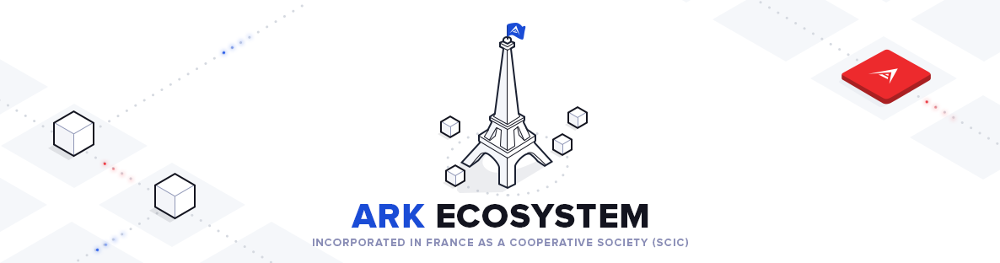
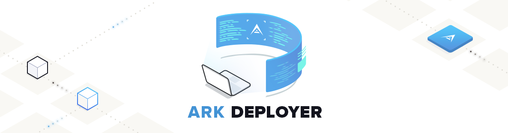

### Building an open-source blockchain ecosystem with ARK
<br/>

<a href="https://www.linkedin.com/in/kristjankosic/">@fa[address-card]Kristjan Kosic</a>
<br/>
<a href="https://www.ark.io">@fa[firefox] ARK.io</a>
<br/>
<a href="https://github.com/arkecosystem">@fa[github] github.com/arkecosystem</a>

---
### AGENDA
- History
- Why OSS maters
- Why and What is ARK?
- How we Use OSS at ARK?
- Core v2 new features
- Workshop...

---
### @fa[history] Looking back...
- Ten (10) years into **decentralisation** revolution
  - CyberPunks movement (Nick Szabo..)
  - Satoshi, Bitcoin birth, whitepaper

<br/>
- Thru the phase of disillusionment (hype cycle)
  - Experimental solutions @fa[arrow-circle-right] Complete solutions
    - 1600 cryptocurrencies
    - <100 platforms or ecosystems

+++
### @fa[history] @fa[history] @fa[history] Looking back...
- David Chaum introduced digital cash as a research topic [1983]
  - central server to prevent double spending (SPV)

</br>

- Central servers === Achilles’ heel of digital cash [1999]


+++?image=assets/images/edonkey-emule.png
@title[eMule]


+++
### @fa[history] @fa[history] Looking back...
- Fat protocols aren’t new
- 1999: explosion of p2p file sharing technology
  - Gnutella (Limewire), FastTrack (Kazaa), eDonkey, and  eMule

- ALL where:
  - OSS solutions
  - Distributed p2p systems
  - No value transfer

+++?image=assets/images/flatthin_white.png
@title[flaththin comparisson]

---?image=assets/images/github-octocat-git-programming-code-it.jpg&position=center&size=auto 100%
@title[OSS-Intro]

+++
### Open Source Software(OSS): Wave of the Future
- Cost reduction
- Quality improvement
- Quicker time to market
- Full ownership and control
- Drive innovation with rapid-pace
- No vendor lock-in
- More eyes on the code
- Integration and collaboration
- Community support (Live Help Desk)

+++
### Open Source Software(OSS): Wave of the Future
- Survey by <a href="http://www.infosysblogs.com/infosysdigital/2016/06/open_source_software_wave_of_future.html">Black Duck Software [N: 1313]</a>
  - 78%  of enterprises run on open source
  - 65% companies are contributing to open source projects
  - 73% agree that git is the overwhelming choice for versioning
  - 90% agree that OSS is the engine of innovation

+++
### Open Source Software(OSS): Challenges
- Survey by <a href="http://www.infosysblogs.com/infosysdigital/2016/06/open_source_software_wave_of_future.html">Black Duck Software [N: 1313]</a>
  - 50% of companies have no formal policy for choosing open source code
  - 47%  have no formal process in place to track open source code
  - 1/3 of companies have no process for identifying, tracking or remediating known open source vulnerabilities
  - 50% of OSS project have no license defined

+++
@title[CryptoCommQuote]
>@fa[quote-left] The hardest mental leap for people when they join OSS is the move from closed to open. **Code is worth almost nothing. Community is worth everything.** Anyone can fork the code. Very few people can fork a community. @fa[quote-right]

*Internalising that reality is just impossible for some people...*

---
### Current challenges in blockchain space
- Interoperability/Integration
  - standalone environments
  - sandboxed blockchains
  - low usability

- Ease of Use (developer friendly)
- Regulation
- Complexity (end-users)
- Speed of processing

---?image=assets/images/background.png&position=center&size=auto 100%
@title[ARK]
---

### WHAT IS ARK?
>@fa[quote-left] Ark aims to create an entire ecosystem of linked chains by providing easy to use tools to deploy your own blockchain.@fa[quote-right]

- ARK is Open-Source by design [MIT License]
  - 50+ repositories
  - 20000+ commits
- Highly flexible and adaptable
- DPOS Consensus Mechanism (3rd generation)

---
#### Decentralized and incorporated in FRANCE

<br/>
<br/>
- <a href="https://blog.ark.io/ark-creates-a-unique-business-entity-827c488c7fb8">SCIC - Cooperative Society of Collective Interest </a>
  - new legal from to address crypto world
- 26 board members and founders
- <a href="https://www.ark.io/team">Distributed team</a>

---
</br>
</br>
</br>

<div align="center">
  <font size="14 em">
  <strong>REGULATION</strong>
  </font>
  </br>
  </br>
  @fa[check-circle fa-3x]
</div>
---

### OSS APPROACH AT ARK
- <a href="https://docs.ark.io/docs/contributing">Contributing guidelines defined</a>
- <a href="https://github.com/ArkEcosystem/core/blob/master/packages/core-api/CHANGELOG.md">Keep a Change Log</a>
- <a href="https://docs.ark.io/">Clearly defined user instructions and documentation</a>
- Defined and described dependencies
- <a href="https://docs.ark.io/v1.0/reference">API docs generated</a>
- Tests defined with full coverage
- <a href="https://github.com/ArkEcosystem/core/pull/653">Strict and clear PR template</a>
- Multiple people reviewing the code
- <a href="https://blog.ark.io/ark-github-development-bounty-113806ae9ffe">Active Bounty Program - Monthly competition</a>

---?image=assets/images/acflogo.png&position=center&size=80% auto&color=white
@title[ACF]

---
### <a href="https://arkcommunity.fund/">ARKCommunity.Fund.</a>
>*The goal of the ACF is to sponsor community projects benefiting the ARK Ecosystem. It can be seen as supplemental to the core development of ARK Ecosystem and will support the ideas and projects of ARK community members.*


---
### <a href="https://arkaces.com/">Interoperability with ACES</a>
- Ark Contract Execution Services
- Project by ARK Community members
- The Blockchain Interoperability Platform
- Provides protocol and tools for building blockchain service marketplace
- Chain independent

---
### Bridgechain
>Bridgechain is natively connected with the Mainnet on launch. Both code bases of the Ark Mainnet and the Ark Bridgechain allow interoperability between the chains.

Both blockchains are able to exchange information and value without any need for additional services.

---
### Sidechain
>A sidechain is an own chain running on an own network but tightly coupled and verified by the mainnet governance.

Put simply, sidechaining is any mechanism that allows tokens from one blockchain to be securely used within a completely separate blockchain but still moved back to the original chain if necessary.

---
### Smartbridge
>SmartBridge is the ability to connect and communicate between blockchains.

Ark’s SmartBridge communicates between the blockchains using a special data section called Vendor Fields and special Encoded Listener nodes that comb through this data for tasks that it can perform.

---?image=assets/images/aces-linking-services.png&position=center&size=auto 100%&color=white
@title[ACES]


---
</br>
</br>
</br>

<div align="center">
  <font size="14 em">
  <strong>INTEROPERABILITY</strong>
  </font>
  </br>
  </br>
  @fa[check-circle fa-3x]
</div>

---?color=white

```bash
git clone https://github.com/ArkEcosystem/ark-deployer.git
cd ark-deployer

vagrant up
```
<a href="https://blog.ark.io/ark-deployer-setup-guide-c10825ebb0e4">More detailed setup guide</a>

---?image=assets/images/v2_release.png&position=center&size=auto 100%&color=white
@title[ARK v2 title]

---?image=assets/images/v2-1.png&position=center&size=auto 100%&color=white
@title[ARK v2 - node structure]

---?image=assets/images/ConfigurableCore.jpg&position=center&size=auto 100%&color=white
@title[ARK v2 - network view]

---
### ARK CORE v2 TOP FEATURES
- Developer friendly blockchain ecosystem
- Fully configurable DPOS core
- <a href="https://github.com/ArkEcosystem">Client SDKs available >20 programming languages</a>
- <a href="https://docs.ark.io/v1.0/reference">Standard API interfaces</a>
- <a href="https://github.com/ArkEcosystem/core#core-packages">Plugin based system</a>
- <a href="https://docs.ark.io/docs/webhooks-2">WebHooks for blockchain events</a>
- Dynamic fees via AIP 11
- Fully backwards compatible

---
### DPoS configurable core
```json
{
  "name": "devnet",
  "messagePrefix": "DARK message:\n",
  "bip32": {
    "public": 46090600,
    "private": 46089520
  },
  "pubKeyHash": 30,
  "nethash": "578e820911f24e039733b45e4882b73e301f813a0d2c31330dafda84534ffa23",
  "wif": 170,
  "client": {
    "token": "DARK",
    "symbol": "DѦ",
    "explorer": "https://dexplorer.ark.io"
  },
  "constants": [{
    "height": 1,
    "reward": 0,
    "activeDelegates": 51,
    "blocktime": 8,
    "block": {
      "version": 0,
      "maxTransactions": 50,
      "maxPayload": 2097152
    },
    "epoch": "2017-03-21T13:00:00.000Z",
    "fees": {
      "dynamic" : false,
      "transfer": 10000000,
      "secondSignature": 500000000,
      "delegateRegistration": 2500000000,
      "vote": 100000000,
      "multiSignature": 500000000,
      "ipfs": 0,
      "timelockTransfer": 0,
      "multiPayment": 0,
      "delegateResignation": 0
    },
    "dynamicOffsets": {
      "transfer": 100,
      "secondSignature": 250,
      "delegateRegistration": 500,
      "vote": 100,
      "multiSignature": 500,
      "ipfs": 250,
      "timelockTransfer": 500,
      "multiPayment": 500,
      "delegateResignation": 500
    }
  }
}
```
@[17-24](DPOS consensus mechanism properties)
@[27-37](Static fee properties)
@[39-48](Dynamic fee offsets for formula calculation)

---
### New Plugin registration
```javascript
{
  "name": "@vendor/your-plugin-name",
  "description": "This plugin provides X for ARK Core 2.0",
}
{
  'use strict'
  const listener = require('./listener')
  const Twilio = require('./twilio')

  exports.plugin = {
    pkg: require('../package.json'),
    register: async (container, options) => {
      logger.info('[Monitor] Waiting for Missed Blocks')
      listener.setUp(options, new Twilio(options.twilio))
    }
}
{
  module.exports = {
    '@arkecosystem/core-event-emitter': {},
    '@arkecosystem/core-config': {},
    '@arkecosystem/core-logger': {},
    ...

    '@vendor/your-plugin-name': {
      publicKey: 'your-delegate-public-key',
      twilio: {
        body: '%s is missing',
        to: '+12345678901',
        from: '+12345678901'
      }
    },
  }
}
```
@[2-3](Plugin name)
@[6-15](Plugin setup)
@[22-32](Registration of plugin in the plugins.json network setup)

---
### New Plugin registration
```bash
bash
git clone https://github.com/ArkEcosystem/core-plugin-skeleton your-plugin-name
cd your-plugin-name

yarn install
```
---

### The raw truth...
>Most projects will fail, but the **open-source nature** of the **ecosystem** means learnings and code will be available to all.

**We can learn and build faster than ever**.

>The power of OSS and social coding.

---
# @fa[question-circle] Questions
- Build your own blockchain with ARK workshop
  - ARK Deployer (own chain)
  - v2 Overview
  - Custom plugin development
  - ARK ACES Demo

---
## How to build your own blockchain with ARK?
### Hands-on Workshop
<br/>

Kristjan Kosic

Rok Haluzan

---
### Deploy your own ARKBridgechain
>We share the tools we have built and use in our daily work. They are proven and trusted.

---
### Deploy your own ARKBridgechain
- <a href="https://blog.ark.io/ark-deployer-setup-guide-c10825ebb0e4">Bridgechain Deployer</a>
- <a href="https://github.com/ArkEcosystem/explorer">Explorer</a>
- Wallets (with Ledger HW key support):
  - <a href="https://github.com/ArkEcosystem/desktop-wallet">Desktop wallet</a>
  - <a href="https://github.com/ArkEcosystem/mobile-wallet">Mobile wallets (iOS and Android)</a>
- <a href="https://docs.ark.io/v1.0/reference">Proven Standard API and plugins</a>
- <a href="https://docs.ark.io/v1.0">Documentation</a>

--- 

DPOS Simulation

---

```bash
git clone https://github.com/ArkEcosystem/ark-deployer.git
cd ark-deployer

vagrant up
```
<a href="https://blog.ark.io/ark-deployer-setup-guide-c10825ebb0e4">More detailed setup guide</a>

---
### DEVNET
1. Running developer network to test and play
2. Get DARK tokens here:
  - https://kristjank.github.io/dark-paperwallet/
  - generates a wallet and sends 50 DARK to it
3. Checkout the documentation to get started
  - https://docs.ark.io

---
### Development environment setup

- Docker:
  - https://github.com/ArkEcosystem/core
  - https://docs.ark.io/v1.0/docs/docker

---
### Creating your own plugin
- Plugin skeleton checkout
  - basic structure
  - dependent packages 
  - settings
  - business logic

```bash
git clone https://github.com/ArkEcosystem/core-plugin-skeleton your-plugin-name
cd your-plugin-name
yarn install
```
---

---
### SMS-NOTIFIER plugin
- Plugin to notify on various blockchain events
- List of possible events: https://docs.ark.io/v1.0/docs/events#section-available-events

```bash
cd core/plugins
git clone https://github.com/kristjank/sms-notifier

lerna bootstrap
```
---


### ACES

- Ark Contract Execution Services
- Project by ARK Community members
- The Blockchain Interoperability Platform
- Provides protocol and tools for building blockchain service marketplace
- Chain independent

---

### SO WHAT IS ACES?

<br>
<br>

- Marketplace
- Services
- Listeners

---

#### MARKETPLACE

A Web Application for searching and executing ACES Service contracts and tracking contract
executions.


---

#### SERVICES

- Perform value transfer
- Deploy smart contracts
- Execute code on blockchain based computing platforms
- Interact with IoT Hardware


Example services:

[ARK->ETH](http://bit.ly/ark-2-eth) ● [ETH->ARK](http://bit.ly/eth-2-ark) ● [ARK->ETH contract](http://bit.ly/ark-2-eth-contract)

---

#### LISTENERS

- Easy consumption of blockchain events via common API
- Services ask listeners to confirm if their requirements have been fulfilled
- Listener does not have to be run by the same person running a service


Example listeners:

[BTC listener](http://bit.ly/aces-btc-listener) ● [ARK listener](http://bit.ly/aces-ark-listener) ● [ETH listener](http://bit.ly/aces-eth-listener)

---

### WHAT CAN YOU DO WITH ACES?

- Make transaction on any\* chain without holding its coin
- Deploy ETH contracts without holding ETH
- Execute functions on ETH without holding ETH
- Run an ICO (receive ETH, ARK, BTC,...)
- Service Linking: BTC to ETH (via ARK)

<p class="annotation">* Currently there are services for ARK~ETH, ARK~BTC, ARK~PRS, ARK A~ARK B</p>

---
### HOW IT WORKS

</br>
</br>
</br>

<div align="center">
  <font size="14 em">
  <strong>1. ARK -> ETH</strong>
  </font>
</div>

---?image=assets/images/aces-ark-to-eth.png?position=center&size=85% 67%&color=white
@title[ACES: ARK to ETH channel service]

---
### HOW IT WORKS

</br>
</br>

<div align="center">
  <font size="14 em">
  <strong>2. Service Linking</strong>
  <p>The design of listeners and services allows to link services using API endpoints.</p>
  </font>
</div>

---?image=assets/images/aces-linking-services.png?position=center&size=75% 80%&color=white
@title[ACES: linking services]

---

### ARK TO ETH IN 3 STEPS


---

#### STEP 1: Clone ARK to ETH repository

<br>
<br>
<br>

```bash
$ git clone git@github.com:deadlock-delegate/aces-ark-eth-demo.git
$ cd aces-ark-eth-demo/
```

---
#### STEP 2: Change settings in docker-compose.yml

```yaml
version: '3'

services:
  ark-eth-channel:
    image: rokson/aces-ark-ethereum-channel-service:latest
    command: mvn spring-boot:run
    environment:
      EVENT_CALLBACK_URL: "http://ark-eth-channel:9190/arkEvents"
      APP_PORT: 9190
      SERVICE_ETH_ADDRESS: "<your-eth-address-hodling-bags-of-eth>"
      SERVICE_FLAT_FEE: 0
      SERVICE_PERCENT_FEE: 1
      ETH_RPC_URL: "http://<eth-rpc>:8545"
      ARK_MIN_CONFIRMATIONS: 5
      ARK_LISTENER_URL: "http://listener-ark:9091"
    expose:
      - "9190"
    ports:
      - "9190:9190"
    volumes:
      - ark-eth-channel:/app

  listener-ark:
    image: rokson/aces-listener-ark
    command: mvn spring-boot:run
    environment:
      APP_PORT: 9091
      ARK_NETWORK: "devnet"
      SERVICE_ARK_NETWORK: "devnet"
      SERVICE_ARK_ADDRESS: "<your-dark-address-where-you-want-to-received-fees>"
      SERVICE_MIN_ARK_STAKE: "0"
      SERVICE_MIN_ARK_FEE: "1"
      SERVICE_REQUIRE_AUTH: 0
    expose:
      - "9091"
    ports:
      - "9091:9091"
    volumes:
      - listener-ark:/app

volumes:
  listener-ark:
  ark-eth-channel:
```
@[8-15](Modify settings for ARK to ETH channel service)
@[8](Used when the service subscribes to events done to generated ARK address)
@[10](ETH address where the service providers holds ETH)
@[11](Define the flat fee for using the service)
@[12](OR define a percentage fee)
@[13](Address of your ETH node)
@[14](Minimum confirmations needed to treat a transaction as valid)
@[15](URL of the ARK listener)
@[27-33](Modify settings for ARK listener)
@[30](Set your ARK address where you want to collect fees)
@[31](Minimum ARK required in your stake account address for the service to work)
@[32](Amount of ARK to charge every 24h to keep the API key active)

---

#### STEP 3: Start the project

```bash
$ docker-compose up
```


---

### ALL THE LINKS

- [Official ACES Github](https://github.com/ark-aces) (primarily Java)
- [Official ACES blog](https://medium.com/@arkaces)
- [ACES Listener docs](https://ark-aces.github.io/aces-listener-docs/)
- [PythAces](http://bit.ly/PythAces): ARK->PRS, ARK->KAPU (Python)
- [Official ACES marketplace](https://marketplace.arkaces.com)
- [ARK->ETH Docker demo](http://bit.ly/aces-ark-2-eth-demo)
- Join #aces on [ARK's Slack](https://ark.io/slack)
