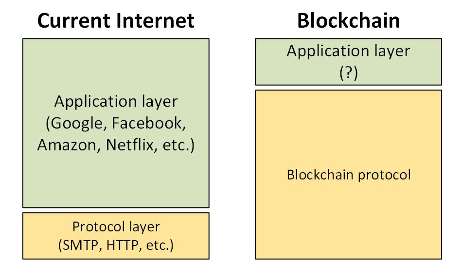

### Building an open-source blockchain ecosystem with ARK

<a href="https://www.linkedin.com/in/kristjankosic/">Kristjan Kosic</a> 
<br/>
<a href="https://www.ark.io">@fa[firefox] ARK.io</a> 
<br/>
<a href="https://github.com/arkecosystem">@fa[github] github.com/arkecosystem</a>

---
### AGENDA
- History

---
### @fa[history] Looking back...
- Ten (10) years into **decentralisation** revolution
  - CyberPunks movement (Nick Szabo..)
  - Satoshi, Bitcoin birth, whitepaper

<br/>
- Thru the phase of disillusionment (hype cycle)
  - Experimental solutions @fa[arrow-circle-right] Complete solutions
    - 1600 cryptocurrencies
    - <100 platforms or ecosystems

+++?image=assets/images/edonkey-emule.png
@title[eMule]

+++
### @fa[history] @fa[history] Looking back...
- David Chaum introduced digital cash as a research topic [1983]
  - central server to prevent double spending (SPV)
- Central servers == Achilles’ heel of digital cash [1999]

+++
### @fa[history] @fa[history] Looking back...
- Fat protocols aren’t new
- 1999: explosion of p2p file sharing technology
  - Gnutella (the protocol behind Limewire)
  - FastTrack (Kazaa)
  - eDonkey, and  eMule
  - BitTorrent a bit later

<br/>
- OSS solutions
- Distributed p2p systems
- No value transfer

+++
### @fa[server] FAT vs. THIN Protocols


---?image=assets/images/github-octocat-git-programming-code-it.jpg&position=center&size=auto 100%
@title[OSS-Intro]

+++
### Open Source Software(OSS): Wave of the Future
- Cost reduction
- Quality improvement
- Quicker time to market
- Full ownership and control
- Drive innovation with rapid-pace
- No vendor lock-in
- More eyes on the code
- Integration and collaboration
- Community support (Live Help Desk)

+++
### Open Source Software(OSS): Wave of the Future
- Survey by <a href="http://www.infosysblogs.com/infosysdigital/2016/06/open_source_software_wave_of_future.html">Black Duck Software [N: 1313]</a>
  - 78%  of enterprises run on open source
  - 65% companies are contributing to open source projects
  - 73% agree that git is the overwhelming choice for versioning
  - 90% agree that OSS is the engine of innovation

+++
### Open Source Software(OSS): Challenges
- Survey by <a href="http://www.infosysblogs.com/infosysdigital/2016/06/open_source_software_wave_of_future.html">Black Duck Software [N: 1313]</a>
  - 50% of companies have no formal policy for choosing open source code
  - 47%  have no formal process in place to track open source code
  - 1/3 of companies have no process for identifying, tracking or remediating known open source vulnerabilities
  - 50% of OSS project have no license defined

+++
@title[CryptoCommQuote]
>The hardest mental leap for people when they join OSS is the move from closed to open. **Code is worth almost nothing. Community is worth everything.** Anyone can fork the code. Very few people can fork a community.

*Internalising that reality is just impossible for some people...*

---
### @fa[history] The raw truth...
>Most projects will fail, but the **open-source nature** of the **ecosystem** means learnings and code will be available to all.

**We can learn and build faster than ever**.

>The power of OSS and social coding.

---
### Current challenges in blockchain space
- Interoperability/Integration
  - standalone environments
  - sandboxed blockchains
  - low usability

- Ease of Use (developer friendly)
- Regulation
- Complexity (end-users)
- Speed of processing 
---

---?image=assets/images/ark-bg.jpg&position=center&size=auto 100%&color=black
@title[ARK]

---?image=assets/images/ark-connecting.png&position=center&size=auto 100%&color=black
@title[ARK-connecting]

---
### WHAT IS ARK?
>*Ark aims to create an entire ecosystem of linked chains by providing easy to use tools to deploy your own blockchain.*

- ARK is Open-Source [MIT License]
  - 50+ repositories
  - 20000+ commits
- Highly flexible and adaptable
- DPOS Consensus Mechanism (3rd generation)

---
#### Decentralized and incorporated in FRANCE

</br>
- <a href="https://blog.ark.io/ark-creates-a-unique-business-entity-827c488c7fb8">SCIC - Cooperative Society of Collective Interest </a>
  - new legal from to address crypto world
- 26 board members and founders
- <a href="https://www.ark.io/team">Distributed team</a>
  
---

### OSS APPROACH AT ARK
- Streamlined and defined developing process:
  - <a href="https://docs.ark.io/docs/contributing">Contributing guidelines defined</a>
  - <a href="https://github.com/ArkEcosystem/core/blob/master/packages/core-api/CHANGELOG.md">Keep a Change Log</a>
  - <a href="https://docs.ark.io/">Clearly defined user instructions and documentation</a>
  - Defined and described dependencies
  - <a href="https://docs.ark.io/v1.0/reference">API docs generated</a>
  - Tests defined with full coverage
  - <a href="https://github.com/ArkEcosystem/core/pull/653">Strict and clear PR template</a>
  - Multiple people reviewing the code
  - <a href="https://blog.ark.io/ark-github-development-bounty-113806ae9ffe">Active Bounty Program - Monthly competition</a>

---?image=assets/images/acflogo.png&position=center&size=80% auto&color=white
@title[ACF]

---
### <a href="https://arkcommunity.fund/">ARKCommunity.Fund.</a>


>*The goal of the ACF is to sponsor community projects benefiting the ARK Ecosystem. It can be seen as supplemental to the core development of ARK Ecosystem and will support the ideas and projects of ARK community members.*

---
### <a href="https://arkaces.com/">ARK-ACES</a>
- Ark Contract Execution Services
- Project by ARK Community members
- The Blockchain Interoperability Platform
- Provides protocol and tools for building blockchain service marketplace
- Chain independent

---?image=assets/images/aces-linking-services.png&position=center&size=auto 100%&color=white
@title[ACES]

---?color=white

```bash
cd ~ && git clone https://github.com/ArkEcosystem/ark-deployer.git 
&& cd ark-deployer

vagrant up
```
<a href="https://blog.ark.io/ark-deployer-setup-guide-c10825ebb0e4">Detailed setup guide</a>

---?image=assets/images/v2_release.png&position=center&size=auto 100%&color=white
@title[ARK v2 title]

---?image=assets/images/v2-1.png&position=center&size=auto 100%&color=white
@title[ARK v2 - node structure]

---?image=assets/images/ConfigurableCore.jpg&position=center&size=auto 100%&color=white
@title[ARK v2 - network view]

---
###ARK CORE v2 TOP FEATURES

- Developer friendly blockchain ecosystem
- Fully configurable DPOS core
- <a href="https://github.com/ArkEcosystem">Client SDKs available >20 programming languages</a>
- <a href="https://docs.ark.io/v1.0/reference">Standard API interfaces</a>
- <a href="https://github.com/ArkEcosystem/core#core-packages">Plugin based system</a>
- WebHooks for blockchain events

---
```json
{
  "name": "devnet",
  "messagePrefix": "DARK message:\n",
  "bip32": {
    "public": 46090600,
    "private": 46089520
  },
  "pubKeyHash": 30,
  "nethash": "578e820911f24e039733b45e4882b73e301f813a0d2c31330dafda84534ffa23",
  "wif": 170,
  "client": {
    "token": "DARK",
    "symbol": "DѦ",
    "explorer": "https://dexplorer.ark.io"
  },
  "constants": [{
    "height": 1,
    "reward": 0,
    "activeDelegates": 51,
    "blocktime": 8,
    "block": {
      "version": 0,
      "maxTransactions": 50,
      "maxPayload": 2097152
    },
    "epoch": "2017-03-21T13:00:00.000Z",
    "fees": {
      "dynamic" : false,
      "transfer": 10000000,
      "secondSignature": 500000000,
      "delegateRegistration": 2500000000,
      "vote": 100000000,
      "multiSignature": 500000000,
      "ipfs": 0,
      "timelockTransfer": 0,
      "multiPayment": 0,
      "delegateResignation": 0
    },
    "dynamicOffsets": {
      "transfer": 100,
      "secondSignature": 250,
      "delegateRegistration": 500,
      "vote": 100,
      "multiSignature": 500,
      "ipfs": 250,
      "timelockTransfer": 500,
      "multiPayment": 500,
      "delegateResignation": 500
    }
  }
}
```
@[17-24](DPOS consensus mechanism properties)
@[27-37](Static fee properties) 
@[39-48](Dynamic fee offsets for formula calculation) 

---
### ARK CORE v2 TOP FEATURES

---
# @fa[question-circle] Questions
- Build your own blockchain with ARK workshop
- Wednesday


---
---
---
### Blockchain Workshop - How to build your own blockchain?


--- 

### ACES

- Ark Contract Execution Services
- Project by ARK Community members
- The Blockchain Interoperability Platform
- Provides protocol and tools for building blockchain service marketplace
- Chain independent

---

### SO WHAT IS ACES?

Consists of:

- Marketplace
- Services
- Listeners

---

#### MARKETPLACE

A Web Application for searching and executing ACES Service contracts and tracking contract
executions.


---

#### SERVICES

ACES Services create and execute Service Contracts, which can be anything from uploading a file to
a storage blockchain, performing value transfers, creating smart contracts, executing code on
blockchain based computing platforms, or interacting with IoT hardware.

Services request information from listeners to confirm whether their requirements have been
fulfilled. The service provider does not need to run a listener of their own.

Example services:
- ARK->ETH channel service: http://bit.ly/ark-2-eth
- ETH->ARK channel service: http://bit.ly/eth-2-ark
- ARK->ETH contract service: http://bit.ly/ark-2-eth-contract

---

#### LISTENERS

The ACES Listener API provides a way for all the different blockchain transaction events to be
easily consumed via a common REST-FUL API. It's the component that plugs into a blockchain
(eg. Bitcoin) and provides standardized API access for ARK services to receive data from a
blockchain. The listener stands on its own, and does not necessarily need to be run by the same
person running a service.

Docs: https://ark-aces.github.io/aces-listener-docs/

Example listeners:
- BTC listener: http://bit.ly/aces-btc-listener
- ARK listener: http://bit.ly/aces-ark-listener
- ETH listener: http://bit.ly/aces-eth-listener

---

### WHAT CAN YOU DO WITH ACES?

- Make transaction on any\* chain without holding its coin
- Deploy ETH contracts without holding ETH
- Execute functions on ETH without holding ETH
- Run an ICO (receive ETH, ARK, BTC,...)
- Service Linking: BTC to ETH

\*Currently there are services for ARK~ETH, ARK~BTC, ARK~PRS, ARK A~ARK B

---
### How it work

#### 1. ETH -> ARK


---
### How it works

#### 2. Service Linking

The design of listeners and services enabled an option to easily link services together.


---

### Other CONTENT

- Official ACES Github: https://github.com/ark-aces (primarily in Java)
- Official ACES blog: https://medium.com/@arkaces
- ACES Listener docs: https://ark-aces.github.io/aces-listener-docs/
- ARK->PRS, ARK->KAPU: https://github.com/galperins4/PythAces (Python)
- Official ACES marketplace: https://marketplace.arkaces.com/

---
